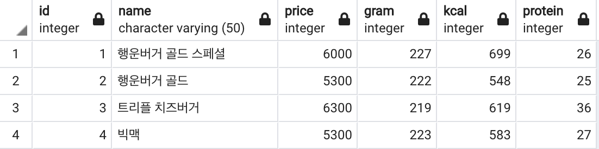
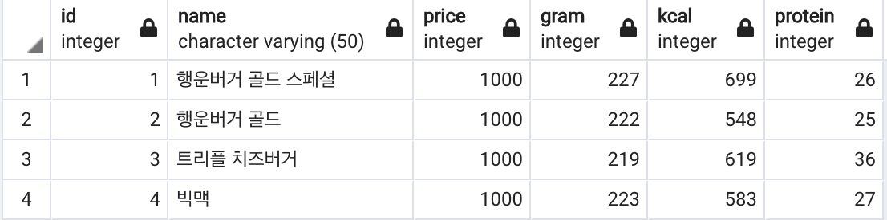
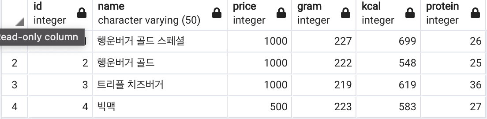
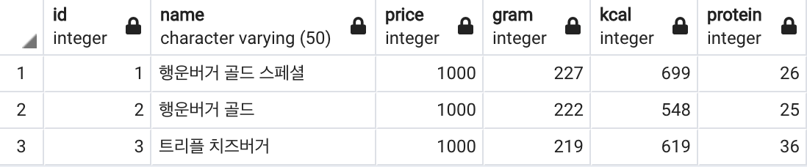

## 1. CREATE
```
-- burgers 테이블 생성 쿼리(DB에게 하는 SQL 명령)
CREATE TABLE burgers(
  id INT,           -- id(숫자)
  name VARCHAR(50), -- 이름(최대 50글자)
  price INT,        -- 가격(숫자)
  gram INT,         -- 무게(숫자)
  kcal INT,         -- 열량(숫자)
  protein INT       -- 단백질량(숫자)
);
```

## 2. INSERT
```
INSERT INTO 
	burgers(id, name, price, gram, kcal, protein)
VALUES
	(1, '행운버거 골드 스페셜', 6000, 227, 699, 26);

-- 생성 쿼리 2
INSERT INTO 
	burgers(id, name, price, gram, kcal, protein)
VALUES
	(2, '행운버거 골드', 5300, 222, 548, 25),
	(3, '트리플 치즈버거', 6300, 219, 619, 36),
	(4, '빅맥', 5300, 223, 583, 27);
```

## 3. READ
```
select * from burgers;
```


## 4. UPDATE
```
UPDATE
  burgers         -- 모든 버거
SET
  price = 1000;   -- 1000원 개꿀
-- 수정 쿼리#2
UPDATE
  burgers        -- 1: 해당 테이블에서
SET
  price = 500    -- 3: 가격을 500원으로 수정
WHERE
  id = 4;        -- 2: id가 4인 대상의
```



## 5. DELETE
```
-- 삭제 쿼리
DELETE FROM
  burgers    -- 1: 버거 테이블에서
WHERE
  id = 4;    -- 2: id가 4인 대상을 삭제
```


***
<details>
<summary>출처</summary>
이 글은 유튜버 홍팍(https://www.youtube.com/c/%ED%99%8D%ED%8C%8D)님의
SQL 데이터 분석, 입문! 강의를 통해 배운 내용들을 작성하였습니다.
</details>