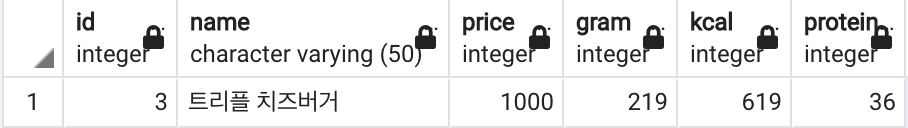
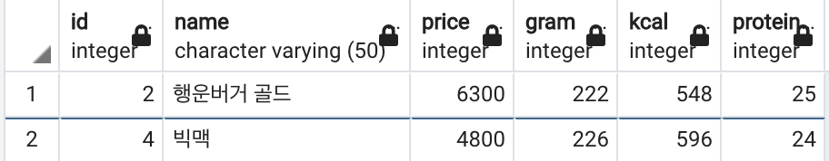
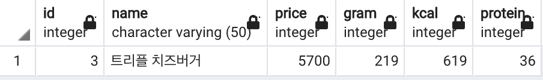

## 1. 데이터 필터링 이란?
DB에는 수많은 데이터가 존재하는데 그 중에서 내가 필요한 것만 사용하겠다는 것을 의미한다.

## 2. 실습
다양한 햄버거 중, 원하는 조건을 만족하는 버거를 찾아보자.

### 비교 연산자
5천원 이상인 버거를 조회하시오.

```
SELECT         -- 3: 모든 컬럼을 조회!
  *
FROM           -- 1: 해당 테이블을
  burgers
WHERE          -- 2: 다음 조건으로 필터링한 뒤,
  price >= 5000
;
```

### AND, 논리 연산자
단백질이 25g 보다 많으면서, 동시에 칼로리는 550kcal 미만인 버거를 조회하시오.
```
SELECT         -- 3: 모든 컬럼을 조회!
  *
FROM           -- 1: 해당 테이블을
  burgers
WHERE          -- 2: 다음 조건으로 필터링한 뒤,
  protein > 25
    AND
  kcal < 550
;
```

### OR, 논리 연산자
단백질 30g 이상, 또는 kcal 500 이하 버거를 조회하시오.
```
SELECT         -- 3: 모든 컬럼을 조회!
  *
FROM           -- 1: 해당 테이블을
  burgers
WHERE          -- 2: 다음 조건으로 필터링한 뒤,
  protein > 30
    OR
  kcal <= 500
;
```

## 3. 훈련
쿼리를 작성하여, 다음 조건을 만족하는 버거를 모두 찾으시오.
```
-- 단백질이 30g 이상인 버거
select *
from burgers
where protein >=30
```



```
-- 단백질이 20g 이상이면서 칼로리가 600kcal 미만인 버거
select *
from burgers
where protein >=20 and kcal < 600
```



```
-- 단백질이 30g 이상이거나, 가격이 4000원 이하인 버거
select *
from burgers
where protein >= 30 or price <= 4000
```



***
<details>
<summary>출처</summary>
이 글은 유튜버 홍팍(https://www.youtube.com/c/%ED%99%8D%ED%8C%8D)님의
SQL 데이터 분석, 입문! 강의를 통해 배운 내용들을 작성하였습니다.
</details>