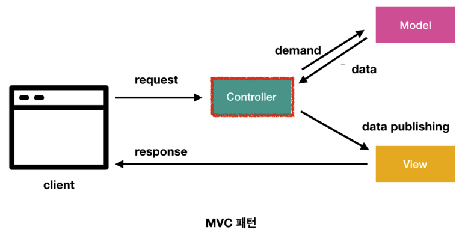
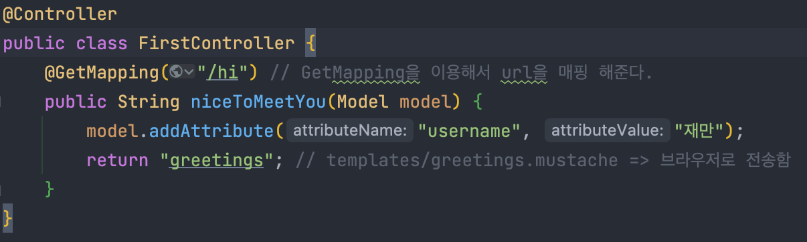
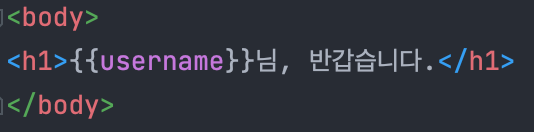

## 1. MVC 패턴이란?

MVC는 각각 Model, View, Controller를 나타낸다.

사용자가 웹 애플리케이션을 이용하기 위해 URL 요청을 하면, 해당 요청은 Controller에 들어오게 된다.

Controller은 해당 요청을 담당하는 메소드로 안내하고, 요청에 포함된 정보를 가지고 Model에 접근할 수 있다.

Model은 데이터베이스같은 비즈니스 로직을 처리하는 일을 수행하고 Controller로 다시 돌아온다.

Controller의 처리가 끝났다면 그 결과를 사용자들이 화면을 통해 볼 수 있도록 View로 이동시켜준다.

## 2. @Controller, @GetMapping

먼저 컨트롤러 클래스에 @Controller 라고 선언을 하게 되면 컨트롤러가 설정된 것이다.

해당 컨트롤러를 사용하기 위해서 메소드를 생성해 주는데 이때 @GetMapping 을 이용해서 GET 방식의 url 매핑을 해줄수 있다.

메소드를 작명 한 후 Model을 파라미터로 받아오게 되면 변수를 등록할 수 있게 된다.

## 3. Mustache

다양한 언어들을 지원하는 심플한 템플릿 엔진이다.

### 템플릿 엔진?

템플릿 엔진은 "프로그램 로직" <-> "프리젠테이션" 계층을 분리하기 위한 수단

예를 들어 Controller -> View로 데이터를 던지면 어떻게 계층을 분리하여 쉽게 표현할지를 도와주는 "도구"

프리젠테이션 계층에서 로직을 쉽게 표현하고 개발의 유연성을 향상 시킴 & 유지보수 효율 향상

### Mustache의 장점
문법이 다른 템플릿 엔진보다 심플하다.

로직 코드를 사용할 수 없어 View의 역할과 서버의 역할을 명확하게 분리된다.

### 다른 템플릿 엔진의 단점

* JSP,Velocatity: 스프링 부트에서는 권장하지 않는 템플릿 엔진이이다.
* Freemarker: 템플릿 엔진으로는 너무 과하게 많은 기능을 지원한다.
* Thymeleaf: 스프링 진영에서 적극적으로밀고 있지만 문법이 어렵다.

### 간단한 사용 방법

{{}} 이러한 중괄호 안에 attributeName을 작성 한 후 컨트롤러 클래스에서 addAttribute 값에 "username"을 작성하여 연결 시킨 후

attributeValue 값에 내가 원하는 값을 적어 놓으면 반영이 된다.

***

출처

이 글은 유튜버 홍팍(https://www.youtube.com/c/%ED%99%8D%ED%8C%8D)님의
스프링 부트, 입문! 강의를 통해 배운 내용들을 작성하였습니다.

모든 저작권 권한은 홍팍님 에게 있습니다.

