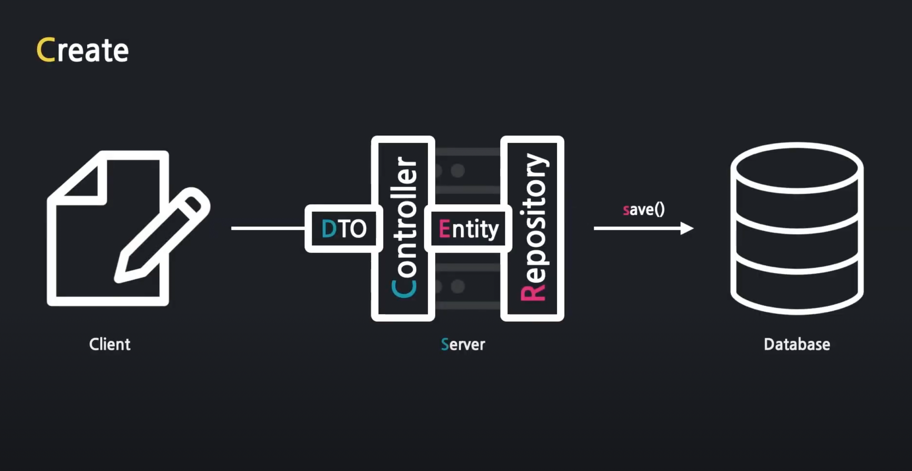

## 1. 데이터 저장 흐름



Server는 JAVA로 이루어져 있으며 DB는 sql로 이루어져 있다. 따라서 자바를 이해하지 못한다.
DB가 JAVA를 이해하도록 하기 위해서, 또한 데이터 관리를 보다 편리하게 하기 위해 JPA를 사용한다.

## 2. JPA란?

JPA는 Java Persistence API 의 약자로서, RDBMS와 OOP 객체 사이의 불일치에서 오는 패러다임을 해결하기 위해서 만들어졌다. 
이러한 JPA는 ORM(Object-Relational Mapping) 기술이다.

### JPA의 핵심도구 Entity, Repository

#### Entity
* 자바 객체(DTO)를 DB가 이해할 수 있게 잘 규격화된 데이터 이다.

#### Repository
* Repository를 통해서 DB에 데이터가 전달되고 처리된다.

## 3. JPA 실습

* ArticleController.java
```
@Autowired // 스프링 부트가 미리 생성해놓은 객체를 가져다가 자동 연결 함
    private ArticleRepository articleRepository;

 public String createArticle(ArticleForm form){
        System.out.println(form.toString());
        
        // 1. DB에 값을 넣기 위해서 dto를 Entity로 변환 해준다.
        Article article = form.toEntity();
        System.out.println(article.toString());
        
        // 2. Repository 에게 Entity를 DB안에 저장하게 함
        Article saved = articleRepository.save(article);
        System.out.println(saved.toString());
        return "";
```

* /entity/Article.java
```
@Entity // Entity라고 정의 해주어야 DB가 해당 객체를 인식할 수 있음
public class Article {

    @Id // id 값은 필수로 작성해야 함
    @GeneratedValue // id 값이 1, 2, 3, ... 순서대로 자동 생성해주는 어노테이션
    private Long id;

    @Column
    private String title;
    @Column
    private String content;

    public Article() {

    }
    
    public Article(Long id, String title, String content) {
        this.id = id;
        this.title = title;
        this.content = content;
    }


    @Override
    public String toString() {
        return "Article{" +
                "id=" + id +
                ", title='" + title + '\'' +
                ", content='" + content + '\'' +
                '}';
    }
}
```

* /dto/ArticleForm.java
```
// dto에 있는 데이터를 entity로 변환해주는 메소드, 또한 객체를 생성하기 위해 생성자를 선언해 줌
    public Article toEntity() {
        return new Article(null,title,content);
    }
```

* /repository/ArticleRepository.java
```
// 첫 번째 파라미터에는 관리대상 Entity, 두 번재 파라미터에는 Entity의 대푯값(id)의 타입을 넣어주어야 한다.
public interface ArticleRepository extends CrudRepository<Article, Long> {

}
```

***
<details>
<summary>출처</summary>
이 글은 유튜버 홍팍(https://www.youtube.com/c/%ED%99%8D%ED%8C%8D)님의
스프링 부트, 입문! 강의를 통해 배운 내용들을 작성하였습니다.

모든 저작권 권한은 홍팍님 에게 있습니다.
</details>
